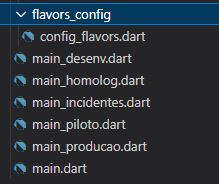

# App Flavors

Exemplo de criação de Flavors para segmentação de ambientes e recursos.

* Biblioteca utilizada: <https://pub.dev/packages/flutter_flavorizr>

# Após a criação do projeto local, é necessário copiar os seguintes arquivos desse repositório

**pubspec.yaml ->** Contém as definições dos nomes dos ambientes que serão criados; Deve-se modificar esse arquivo com os nome do projeto antes de rodar o comando da biblioteca flutter_flavorizr. 

**launch.json ->** Contém a configuração de inicialização de cada flavor, com seus respectivos caminhos

**flavors_config/ ->** esse diretório contém os códigos de incialização dos flavors e variáveis de ambiente 

**main.dart ->** Contém a inicialização que aponta para o Flavor.DESENV como padrão, caso não seja 

passada nenhuma outra configuração

Após a cópia dos arquivos devemos rodar no terminal, dentro da pasta da aplicação, o comando:

**flutter pub run flutter_flavorizr**  

Esse comando gera, nas pastas nativas do seu projeto(Android e ios), as configurações de Flavors, atualiza o build.gradle, o info.plist e gera arquivos main para cada ambiente mapeado no pubspec.yaml. 

Também irá gerar o diretório pages/ , que deverá ser apagado. Também gerará vários arquivos "main_nomeDoAmbienteDoFlavor.dart",

que deverão ser substituidos pelos contidos nesse repositório, os quais apontam para a função initFlavor, que recebe um flavor e monta a sua configuração.

 Ou seja, iremos manter apenas a pasta flavors_config/ com seus arquivos, o arquivo main.dart e os arquivos "main_nomeDoAmbienteDoFlavor.dart" que foram substituídos pelos desse repositório, parecendo-se com a imagem abaixo:

